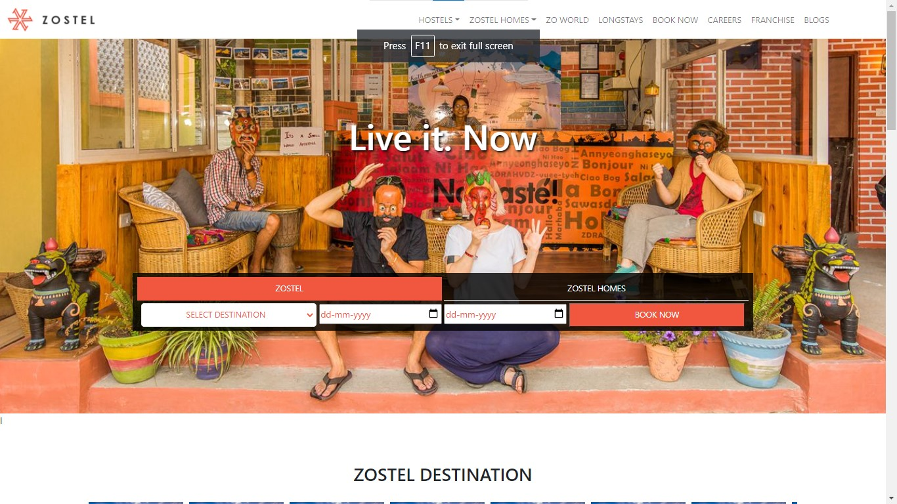
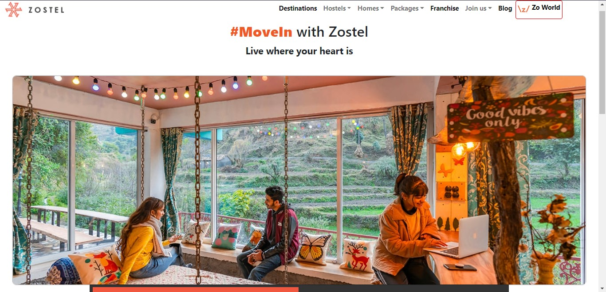
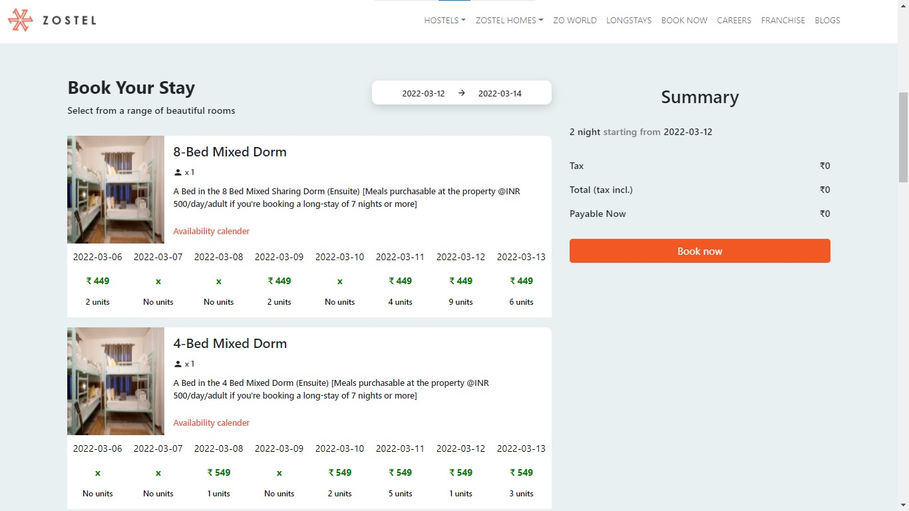
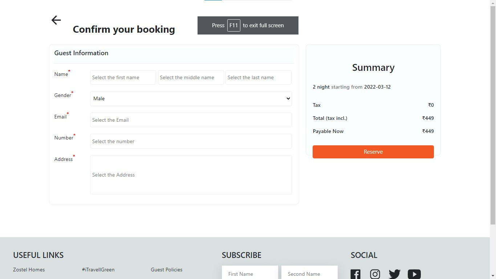

# ZOSTEL CLONE
Zostel is one of the largest and oldest networks of hostels and homes in India.<br>
<p align="center">
<ol >
<li>
 <h3>Landing Page</h3><br>

</li>
<li>
<h3>LongStayPage</h3><br>

</li>
<li>
<h3>Book Your Stay Page</h3><br>

</li>
<li>
<h3>Confirm Booking Page</h3><br>

</li>
</p>
</ol>

## Technologies used :-
1) React
2) BOOTSTRAP
3) Context API
4) Mock server


## Contributions:-

### Pratham Agrawal  [GitHub](https://github.com/pratham2002) - [LinkedIn](https://www.linkedin.com/in/pratham-agrawal-940590174)

### Suryakant  [GitHub](https://github.com/skant-2000) - [LinkedIn](https://www.linkedin.com/in/suryakant-1085b3171/)

### Shanu [Github](https://github.com/Shanu30) - [LinkedIn](https://www.linkedin.com/in/kumar-shanu-a73636140)


## Deploy Locally

### Steps to deploy
```
  git clone https://github.com/skant-2000/Project_ZOSTEL                // Clone This Repo
  cd PROJECT_ZOSTEL                                                     // Move to the repo
  npm install                                                           // install required dependencies
  npm run server                                                        // Run the mock server
  npm run start                                                         // Run the website
```


Now Visit  [localhost:3000](http://localhost:3000)